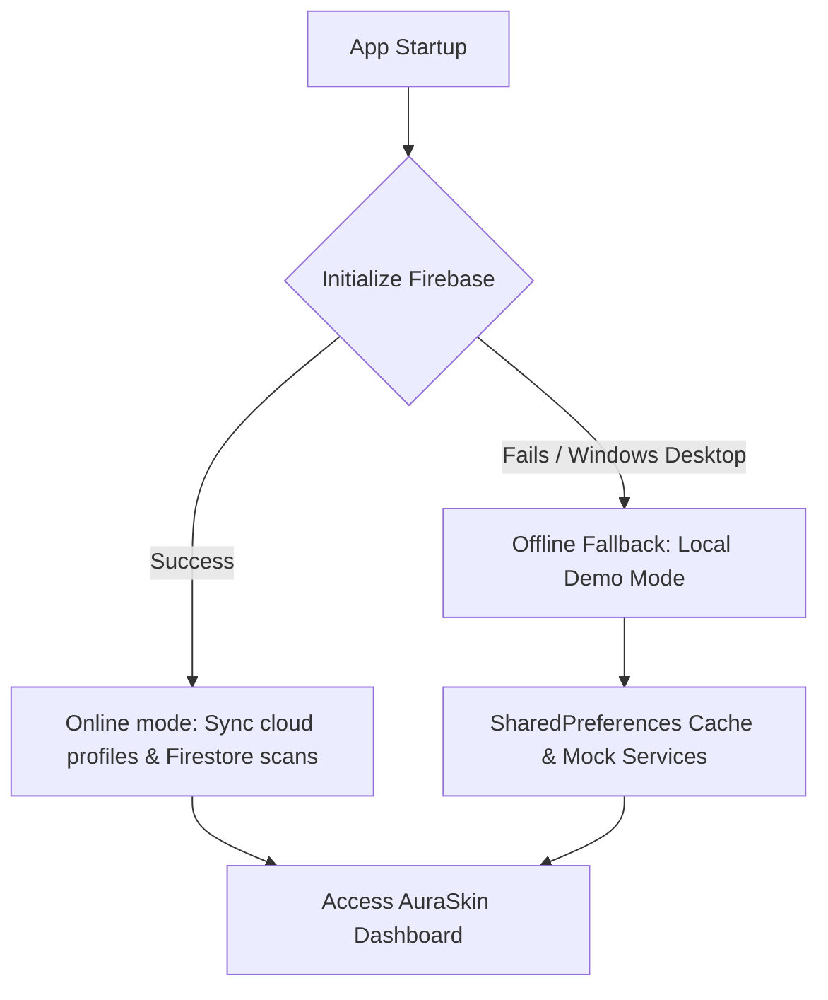
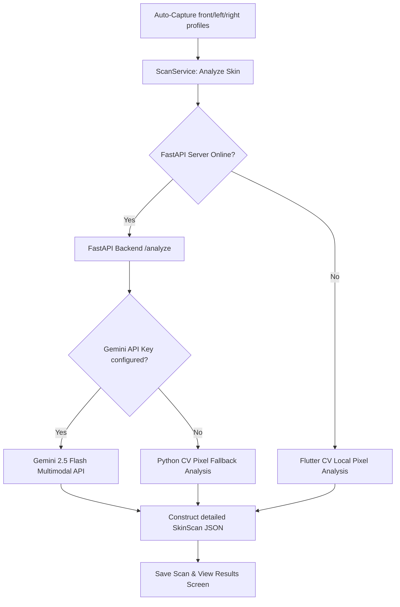

<div align="center">

# ✨ AURASKIN AI ✨
### *Understand your skin, clearly.*

[](https://flutter.dev)
[](https://dart.dev)
[](https://fastapi.tiangolo.com)
[](https://ai.google.dev)
[](https://firebase.google.com)
[](https://flutter.dev)

A premium, high-fidelity skin analysis companion and facial aesthetics guide. Inspired by advanced diagnostics from **Qoves Studio**, it combines pixel-level skincare analysis with geometric facial proportions.

[🚀 Explore Installation](#-getting-started) • [🎨 Premium UI Features](#-key-features) • [🌐 Core Architecture](#-system-architecture)

---

</div>

## 🌟 Key Features

### 🔍 1. Real-Time AI Face Alignment & Camera Pipeline
*   **Google ML Kit Integration**: Active face tracking monitors roll, pitch, yaw, distance, and centering in real-time.
*   **Haptic Alignment Feedback**: Smart vibration patterns trigger to notify the user if alignment or head positioning is incorrect.
*   **Automated Step Capture**: Guided step-by-step capturing process for **Front View**, **Left Profile**, and **Right Profile**, auto-snapping when alignment matches ideal constraints.

### 📐 2. Qoves-Inspired Aesthetics & Anatomy Guide
*   **Bilateral Symmetry Scan**: Calculates color and contrast deviations across facial halves to output symmetry indices.
*   **Anatomical Landmarks Mapping**: Interactive guides explaining key facial structure boundaries: Glabella (G), Pronasale (Prn), Subnasale (Sn), Menton (Me), Exocanthion (Ex), and Gonion (Go).
*   **Proportion Estimator**: Real-time validation of vertical facial thirds ratios (Forehead, Midface, Lower Face) against the anatomical ideal of 33.3% each.
*   **Mandibular Angle**: Automatically calculates gonial angles to evaluate jawline definition.

### 🧘 3. Dynamic Results Dashboard & Treatment Predictor
*   **Dual-Layer Overlays**: Glow overlays mapping skin care concerns (acne, redness, oiliness, wrinkles, dark circles) and facial skeletal third boundaries.
*   **Skincare & Grooming Tips**: Tailored cleansers, serums, and moisturizers based on blemish indexes, plus custom hair and beard styling recommendations.
*   **Time-Lapse Healing Predictor**: Simulated time slider displaying skin recovery progress over a 12-month period based on clinical target treatments.

### ⚙️ 4. Premium Profile & Endpoint Configurations
*   **User Profile Editor**: Edit name, age, gender, skin concerns, and custom notification parameters.
*   **Custom Server URL & API Keys**: Input custom machine IP endpoints and personal Gemini API keys directly inside the App settings.

---

## 🌐 System Architecture

AuraSkin AI features a self-healing hybrid structure. The app prioritizes the high-performance FastAPI server to compute advanced blemish maps using Gemini 2.5 Flash, falling back to local client-side computer vision models if offline.

### 1. Initial Launch flow


### 2. Multi-Angle Diagnostic Engine


---

## 📊 Feature Matrix Comparison

| Feature | 📱 Android Target | 💻 Windows Target (Local Fallback) |
| :--- | :---: | :---: |
| **Bilateral Face Symmetry** | ✅ Active | ✅ Active |
| **Dual-Layer Wireframes** | ✅ Active | ✅ Active |
| **Face Toning Routines** | ✅ Active | ✅ Active |
| **Real-time Camera Guide** | 📸 ML Kit Auto-Capture | 📁 File Picker Simulation |
| **Authentication** | 🔒 Firebase Auth | 🔑 Local Demo Bypass Key |
| **Data Sync** | ☁️ Cloud Firestore | 💾 SharedPreferences Offline Storage |
| **FastAPI Backend Sync** | ✅ Remote API Sync | ✅ Local Host Sync |

---

## 🚀 Getting Started

### 📋 Prerequisites
Ensure your development environment contains:
*   **Flutter SDK**: `^3.38.7` (Dart `^3.10.7`)
*   **Python**: `^3.9` (For running the diagnostic backend server)
*   **Windows Toolchain**: Visual Studio 2022 with C++ Development workloads (for desktop target).
*   **Android Toolchain**: Android Studio and SDK Tools (for mobile APK packaging).

### ⚙️ Installation & Build Steps

1.  **Clone and Navigate to the workspace:**
    ```bash
    git clone https://github.com/Subrata0Ghosh/skin-analysis-ai.git
    cd skin-analysis-ai
    ```

2.  **Setup and Start the FastAPI Backend Server:**
    ```bash
    cd backend
    pip install -r requirements.txt
    
    # Configure your Gemini API key (Optional: Fallback runs if omitted)
    export GEMINI_API_KEY="your_google_gemini_api_key"
    
    # Run the server
    uvicorn main:app --reload --host 0.0.0.0 --port 8000
    ```
    *Note: When debugging on an Android Emulator, use `http://10.0.2.2:8000` to point to localhost.*

3.  **Resolve App dependencies and run checks:**
    ```bash
    cd ..
    flutter pub get
    flutter analyze
    flutter test
    ```

4.  **Launch the application:**
    *   **To run on Windows Desktop:**
        ```bash
        flutter run -d windows
        ```
    *   **To run on Android Device/Emulator:**
        ```bash
        flutter run -d android
        ```

5.  **Compile release bundles:**
    *   **Windows Release Application:**
        ```bash
        flutter build windows
        ```
        *Executable compiled to:* `build\windows\x64\runner\Release\auraskin_ai.exe`
    *   **Android Release APK:**
        ```bash
        flutter build apk
        ```
        *APK packaged to:* `build\app\outputs\flutter-apk\app-release.apk`

---

## 🎨 Aesthetic Guidelines

AuraSkin AI adheres to a dark-mode premium color palette:
*   **Background**: Rich Obsidian Black (`0xFF0B0C10`)
*   **Cards & Modals**: Deep Graphite Dark Gray (`0xFF1F2833`)
*   **Primary Highlights**: Fine Champagne Gold (`0xFFD4AF37`)
*   **Accent Greens**: Calm Sage Green (`0xFF8EE4AF`)
*   **Diagnostics**: Redness (`0xFFFF6B6B`), Dark Circles (`0xFF8A2BE2`)
