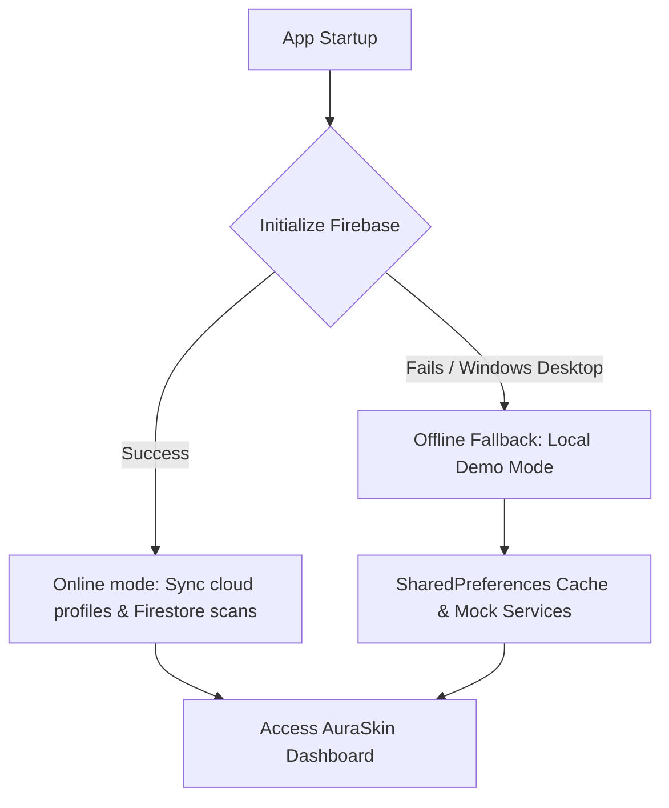

<div align="center">

# ✨ AURASKIN AI ✨
### *Understand your skin, clearly.*

[](https://flutter.dev)
[](https://dart.dev)
[](https://firebase.google.com)
[](https://flutter.dev)

A premium, high-fidelity skin analysis companion and facial aesthetics guide. Inspired by advanced diagnostics from **Qoves Studio**, it combines pixel-level skincare analysis with geometric facial proportions.

[🚀 Explore Installation](#-getting-started) • [🎨 Premium UI Features](#-key-features) • [🌐 Core Architecture](#-system-architecture)

---

</div>

## 🌟 Key Features

### 🔍 1. Dual-Layer Face Analysis
*   **Skin Care Layer**: Maps and highlights dermatological indicators (acne, dark circles, wrinkles, oiliness, and redness hotspots) using glowing translucent overlays.
*   **Facial Structure Layer**: Draws a golden wireframe grid detailing vertical thirds boundaries, sagital midline symmetry, eye alignment, and jawline slope angles.
*   **Bi-directional Navigation**: Tapping visual hotspots on the face scrolls directly to their detailed breakdown card in the analysis feed.

### 📐 2. Qoves-Inspired Aesthetics Metrics
*   **Bilateral Symmetry Scan**: Computes the RGB luminance and color deviation between left and right facial coordinates to evaluate a percentage symmetry index.
*   **Vertical Thirds Proportions**: Evaluates forehead, midface, and lower face height ratios against the anatomical ideal of 33.3% each.
*   **Mandibular Slope**: Estimates the gonial angle of the jawline in degrees.

### 🧘 3. Face Sculpting & Toning Checklist
*   Curated routines for **Mewing** (correct tongue posture), **Gua Sha drainage sweeps**, **Cheekbone lifts**, and **Neck posture adjustments**.
*   Integrated dashboard habit-tracker to log and record routines daily.

### 📅 4. Historical Progress & Comparison
*   **Swipe Compare Slider**: View "Before" and "After" scans side-by-side with an interactive dragging lens.
*   **Trend Charting**: Visualize score progression over weeks and months using a champagne-gold line chart.

---

## 🌐 System Architecture

AuraSkin AI features a self-healing boot cycle. If Firebase is offline or fails to compile (e.g. desktop Windows environment), the app automatically routes traffic to a persistent offline **Local Demo Mode** running on memory cache and `SharedPreferences`.



---

## 📊 Feature Matrix Comparison

| Feature | 📱 Android Target | 💻 Windows Target (Local Fallback) |
| :--- | :---: | :---: |
| **Bilateral Face Symmetry** | ✅ Active | ✅ Active |
| **Dual-Layer Wireframes** | ✅ Active | ✅ Active |
| **Face Toning Routines** | ✅ Active | ✅ Active |
| **Authentication** | 🔒 Firebase Auth | 🔑 Local Demo Bypass Key |
| **Data Sync** | ☁️ Cloud Firestore | 💾 SharedPreferences Offline Storage |
| **Startup Build Status** | ✅ Compiled APK | ✅ Native Release EXE |

---

## 🚀 Getting Started

### 📋 Prerequisites
Ensure your development environment contains:
*   **Flutter SDK**: `^3.38.7` (Dart `^3.10.7`)
*   **Windows Toolchain**: Visual Studio 2022 with C++ Development workloads (for desktop target).
*   **Android Toolchain**: Android Studio and SDK Tools (for mobile APK packaging).

### ⚙️ Installation & Build Steps

1.  **Clone and Navigate to the workspace:**
    ```bash
    git clone https://github.com/Subrata0Ghosh/skin-analysis-ai.git
    cd skin-analysis-ai
    ```

2.  **Resolve dependencies:**
    ```bash
    flutter pub get
    ```

3.  **Run static checks and tests:**
    ```bash
    flutter analyze
    flutter test
    ```

4.  **Launch the application:**
    *   **To run on Windows Desktop:**
        ```bash
        flutter run -d windows
        ```
    *   **To run on Android Device/Emulator:**
        ```bash
        flutter run -d android
        ```

5.  **Compile release bundles:**
    *   **Windows Release Application:**
        ```bash
        flutter build windows
        ```
        *Executable compiled to:* `build\windows\x64\runner\Release\auraskin_ai.exe`
    *   **Android Debug APK:**
        ```bash
        flutter build apk --debug
        ```
        *APK packaged to:* `build\app\outputs\flutter-apk\app-debug.apk`

---

## 🎨 Aesthetic Guidelines

AuraSkin AI adheres to a dark-mode premium color palette:
*   **Background**: Rich Obsidian Black (`0xFF0B0C10`)
*   **Cards & Modals**: Deep Graphite Dark Gray (`0xFF1F2833`)
*   **Primary Highlights**: Fine Champagne Gold (`0xFFD4AF37`)
*   **Accent Greens**: Calm Sage Green (`0xFF8EE4AF`)
*   **Diagnostics**: Redness (`0xFFFF6B6B`), Dark Circles (`0xFF8A2BE2`)
